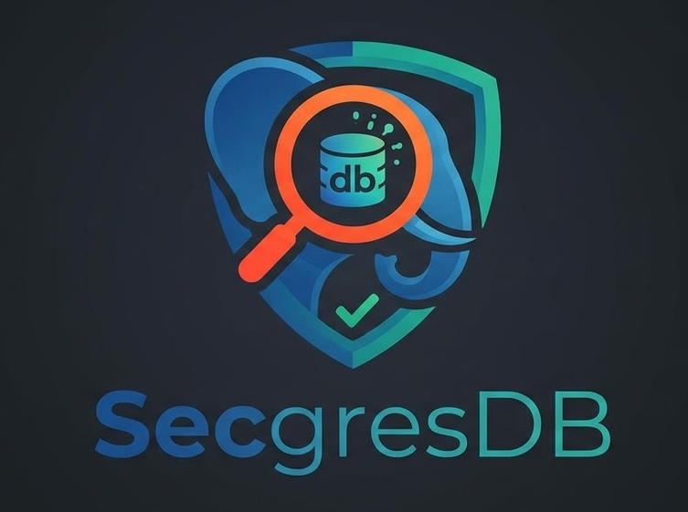

# 🔍 SecgresDB

**SecgresDB** is a powerful CLI tool that scans PostgreSQL databases for sensitive data, helping you ensure compliance with regulations such as **GDPR, CCPA, PCI‑DSS, GLBA**, and more. It uses regex patterns to identify personal identifiable information (PII), payment data, and other regulated content, then outputs a report with regulatory context and risk levels.

  <!-- optional: add a screenshot later -->

---

## ✨ Features

- 🔎 **Automated scanning** – Scans tables and columns for sensitive data patterns.
- 🏷️ **Smart tagging** – Identifies emails, SSNs, credit cards, phone numbers, IP addresses, passport numbers, and more.
- 📜 **Regulatory context** – Each tag is linked to relevant regulations (GDPR, PCI‑DSS, etc.).
- 🎨 **Beautiful CLI** – Rich, color‑coded output with tables, progress bars, and a summary panel.
- 📄 **JSON export** – For integration with other tools.
- 🚀 **Fast & lightweight** – Uses sampling to minimise database load.

---

## 📦 Installation

### Prerequisites
- Python 3.8+
- PostgreSQL (9.5+) with proper credentials

### 1. Clone the repository
```bash
git clone https://github.com/MAXIVA11/SecgresDB.git
cd SecgresDB
```
### 2. Install dependencies
```bash
pip install -r requirements.txt
```

---


## 🚀 Usage
Run the scanner from the project root:
```bash
python main.py --host localhost --port 5432 --database mydb --user postgres --password secret
```

## Command line options

| Option | Description |
|--------|-------------|
| `--host` | Database host (required) |
| `--port` | Database port (default: 5432) |
| `--database` | Database name (required) |
| `--user` | Database user (required) |
| `--password` | Database password (required) |
| `--schema` | Schema to scan (default: public) |
| `--sample-limit` | Number of sample values per column (default: 100) |
| `--patterns` | Path to patterns JSON file (default: config/sensitive_patterns.json) |
| `--output-format` | `table` or `json` (default: table) |
| `--summary-only` | Show only summary, not detailed table |
| `--quiet` | Suppress progress output |
