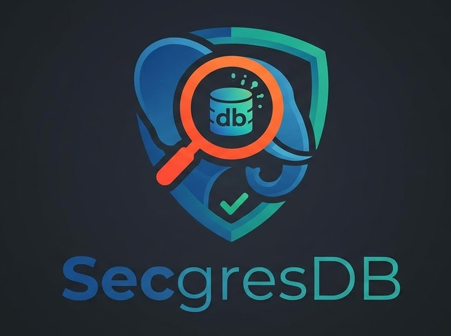
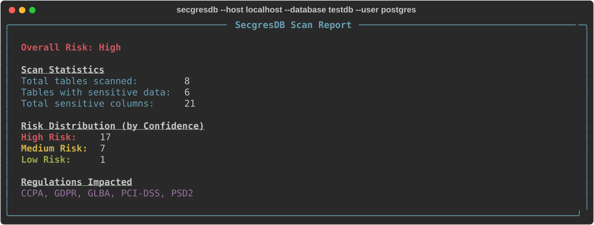

# 🔍 SecgresDB

[](https://github.com/MAXIVA11/SecgresDB/actions/workflows/ci.yml)
[](LICENSE)


**SecgresDB** is a CLI tool that scans PostgreSQL databases for sensitive data, helping Data Protection Officers and engineering teams find and evidence compliance gaps against **GDPR, CCPA, PCI-DSS, GLBA, HIPAA**, and more. It samples table data, matches it against a validated pattern library (with checksum/format validators and column-name-aware confidence scoring), and produces a report you can read on screen, pipe into CI, or file as audit evidence.

<p align="center"></p>

### Why this exists

Most orgs don't actually know where their PII lives — it accumulates in staging tables, forgotten columns, and "temporary" fields nobody cleaned up. That's the gap between "we're GDPR compliant" and actually being able to prove it in an audit. Point SecgresDB at a database and in minutes you get a table-by-table map of what's sensitive, which regulation it implicates (GDPR, CCPA, PCI-DSS, GLBA...), and how confident the finding is — without ever printing the actual sensitive values back at you.

<p align="center"></p>

---

## ✨ Features

- 🔎 **Automated scanning** — Samples every table/column in a schema (or every schema) without a full table scan; uses `TABLESAMPLE` on large tables to keep cost low.
- 🏷️ **Smart tagging** — 16 built-in patterns: emails, SSNs, phone numbers, credit cards, IBANs, MAC/IP addresses, AWS keys, JWTs, and more.
- ✅ **Fewer false positives** — Credit card matches are Luhn-checked, IPs are range-validated, and noisy patterns (ZIP codes, bare 9-digit numbers) only fire when the column name itself corroborates the guess. Matching column names also boost confidence.
- 📜 **Regulatory context** — Each finding is linked to the regulations it implicates, with an aggregate risk score per table and per database.
- 🎯 **Precise targeting** — Include/exclude tables by glob, exclude specific columns, scan one schema or all of them.
- 🔒 **Secure by default** — The scan connection is opened read-only; the password is never required as plaintext on the command line (env var or interactive prompt), and config files never carry secrets.
- 📄 **Multiple report formats** — Rich console table, JSON, flat CSV, or a self-contained HTML report for stakeholders.
- 🚦 **CI-friendly** — `--fail-on-high` exits non-zero when high-confidence PII is found, so a scan can gate a pipeline.
- 🚀 **Fast** — One query per table (not per column), regex compiled once, and row-count-aware sampling.

---

## 📦 Installation

### Prerequisites
- Python 3.8+
- PostgreSQL (9.5+) with read access to the schema(s) you want to scan

### Install
```bash
git clone https://github.com/MAXIVA11/SecgresDB.git
cd SecgresDB
pip install -e .          # installs the `secgresdb` command
# or, without installing the package:
pip install -r requirements.txt
```

For running the test suite or the fake-data seeder:
```bash
pip install -e ".[dev]"   # or: pip install -r requirements-dev.txt
```

---

## 🚀 Usage

```bash
# Password via env var (recommended)
PGPASSWORD=secret secgresdb --host localhost --database mydb --user postgres

# Or omit --password entirely to be prompted interactively
secgresdb --host localhost --database mydb --user postgres

# Not installed? Run directly:
python main.py --host localhost --database mydb --user postgres
```

### Credentials

`--password` is still accepted for convenience/CI, but it's insecure (visible in shell history and process listings). Prefer, in order of precedence:

1. `--password` (explicit, lowest recommended)
2. `PGPASSWORD` or `SECGRESDB_PASSWORD` environment variable
3. Interactive prompt (if running in a terminal and neither of the above is set)

### Config file

Instead of long CLI invocations, put connection/scan defaults in a JSON file:

```json
{
  "host": "db.internal",
  "database": "prod",
  "user": "readonly_scanner",
  "schema": "public",
  "sample_limit": 200,
  "exclude_tables": ["audit_*", "*_archive"],
  "exclude_columns": ["created_at", "customers.internal_notes"],
  "output_format": "html"
}
```

```bash
secgresdb --config scan.json --output-file report.html
```

CLI flags always override the config file. A `password` key in the config file is ignored (with a warning) — secrets don't belong in a file on disk.

## Command line options

| Option | Description |
|--------|-------------|
| `--host` | Database host (required, CLI or config) |
| `--port` | Database port (default: 5432) |
| `--database` | Database name (required, CLI or config) |
| `--user` | Database user (required, CLI or config) |
| `--password` | Database password (insecure; prefer `PGPASSWORD`) |
| `--sslmode` | libpq SSL mode: disable/allow/prefer/require/verify-ca/verify-full (default: prefer) |
| `--connect-timeout` | Connection timeout in seconds (default: 10) |
| `--schema` | Schema to scan (default: public) |
| `--all-schemas` | Scan every non-system schema, overrides `--schema` |
| `--sample-limit` | Rows sampled per table (default: 100) |
| `--patterns` | Path to patterns JSON file (default: `config/sensitive_patterns.json`) |
| `--config` | JSON file providing defaults for any option below |
| `--exclude-table` | Exclude tables matching a glob, e.g. `audit_*` (repeatable) |
| `--include-table` | Only scan tables matching a glob (repeatable) |
| `--exclude-column` | Exclude a column by name, or `table.column` (repeatable) |
| `--output-format` | `table`, `json`, `csv`, or `html` (default: table) |
| `--output-file` | Write the report to this path (csv/html default to a timestamped filename) |
| `--summary-only` | Show only the summary, not the detailed table |
| `--quiet` | Suppress progress output and banners |
| `--fail-on-high` | Exit with status 2 if any high-confidence finding exists |
| `--version` | Print version and exit |

### Exit codes

| Code | Meaning |
|------|---------|
| 0 | Scan completed, no `--fail-on-high` trigger |
| 1 | Connection error, invalid patterns/config file, or unexpected failure |
| 2 | Missing required settings, **or** `--fail-on-high` was set and a high-confidence finding was found |

---

## 🧪 Testing

```bash
pip install -e ".[dev]"
pytest -v
```

The suite runs entirely against a mocked connector — no live database required — and covers pattern validation, scanner matching/confidence logic, CLI argument/config merging, and report generation.

### Real end-to-end testing against a live PostgreSQL instance

The unit suite mocks the database on purpose (fast, deterministic), but it can't catch everything — real scans have caught bugs (regex/checksum edge cases, output-encoding issues) that a mocked connector never would. Point the tool at a real, disposable database before trusting a change:

**No PostgreSQL handy? Get one running in minutes:**

- **Windows, no Docker:** `winget install PostgreSQL.PostgreSQL.17` installs a real local instance as a Windows service — no containers, no WSL required.
- **Docker/macOS/Linux:** `docker run --name secgresdb-test -e POSTGRES_PASSWORD=postgres -p 5432:5432 -d postgres:17`

Then seed it with realistic fake PII across 8 tables (customers, employees, patients, financial records, transactions, vehicles, web logs, biometric data) and scan it for real:

```bash
export PGPASSWORD=postgres   # or pass --password to either command below

python tests/setup_test_db.py --host localhost --user postgres --dbname testdb --drop --rows 300
secgresdb --host localhost --database testdb --user postgres
```

`--drop` gives you a clean slate on repeat runs; drop it to just add more rows. Tear the container down with `docker rm -f secgresdb-test` when you're done, or `winget uninstall PostgreSQL.PostgreSQL.17` for the native install.

---

## 🗂️ Extending the pattern library

Patterns live in `config/sensitive_patterns.json`. Each entry supports:

```json
{
  "name": "Email",
  "description": "Email addresses",
  "regex": "...",
  "confidence": "high",
  "regulations": ["GDPR", "CCPA"],
  "name_hints": ["email", "mail"],
  "requires_name_hint": false,
  "validator": "luhn_checksum"
}
```

- `name_hints` — substrings checked against the column name; a match bumps confidence one level (low→medium→high).
- `requires_name_hint` — for noisy patterns (bare digit sequences, loose date formats), only evaluate the regex when the column name corroborates it. Keeps ZIP-code-shaped numbers from flagging every 5-digit column.
- `validator` — optional secondary check from `secgresdb/validators.py` (currently `luhn_checksum`, `valid_ipv4`, `valid_iban`) applied to the matched substring before it counts as a hit. `valid_iban` runs the real ISO 7064 mod-97 checksum — without it, the loose "2 letters + 2 digits + alphanumeric" IBAN shape also matches things like vehicle VINs by pure chance.

---

## 🔐 Security notes

- The scan connection is opened **read-only** (`SET SESSION CHARACTERISTICS AS TRANSACTION READ ONLY` via psycopg2's `readonly` session flag) — SecgresDB never writes to the database it scans.
- No finding ever includes the actual sensitive value — only the column, pattern name, match coverage, and regulatory tags. Reports are safe to share without becoming a second copy of the PII they describe.
- Credentials are never required as plaintext: `--password` is accepted for convenience but `PGPASSWORD`/`SECGRESDB_PASSWORD` or an interactive prompt are preferred, and config files explicitly reject a `password` key.
- `--sslmode` defaults to `prefer`; set it to `require` or stricter for anything beyond local testing.

---

## 🤝 Contributing

Bug reports, new detection patterns, and PRs are welcome — see [CONTRIBUTING.md](CONTRIBUTING.md) for the dev setup, how to add a pattern safely (checksum validators, name-hint gating), and a list of good starting issues if you're not sure where to jump in.
